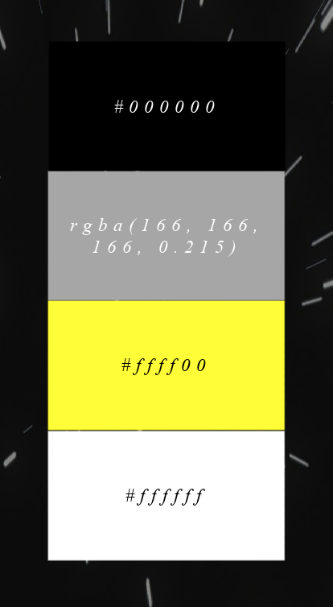
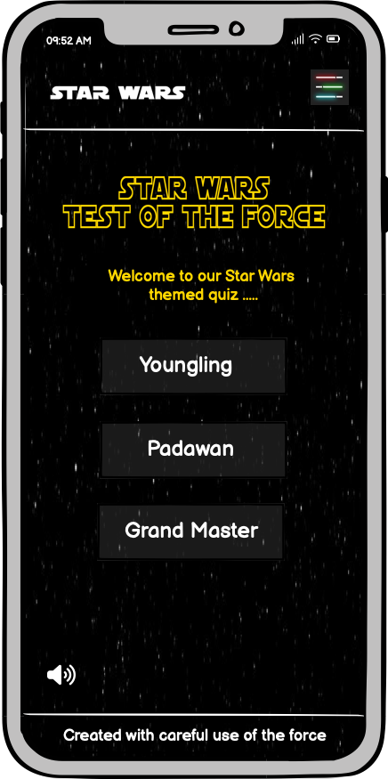

# SUBMISSION
## Deployment

The project is deployed and can be accessed at [Starathon](https://efthymiakakoulidou.github.io/starathon/index.html).

## Criteria
In this section, we will briefly discuss how our team addressed the applicable criteria:

-  Creative use of CSS frameworks (Bulma, Materialize, Bootstrap) to create an engaging and user-friendly design
-  Well-executed project with effective planning using GitHub Projects and a detailed README.md
-  Strong alignment with the Hackathon theme and innovative ideas
-  Project demonstrates responsiveness, accessibility, and thorough testing
-  Innovative features or functionalities beyond standard requirements
-  Emphasizing collaborative effort, active participation of each team member, inclusive practices, and the quality of code produced

# ABOUT SUBMISSION

## Intro
This Starathon is a fun interactive front-end web application presented in a quiz/trivia format. The quiz/trivia format consists of randomly selected questions based on the Star Wars franchise, in 3 difficulty levels end Users can test their Star Wars knowledge. Youngling is the easy mode, Padawan is intermediate and well Grand Master speaks for itself!

Have fun you shall, little Padawan.....

## Goal
The goal section provides a concise summary of the main objective or purpose of the project or software described in this README. It addresses the following aspects:

- ➡️ Problem Statement
- ➡️ Objective(s)
- ➡️ Target Audience
- ➡️ Benefits

## Design
### Colors
The primary color palette for the app is shown below.

### Imagery

### Font
 Font to be used for the logo is 'Star Wars' imported from cdn fonts available at [cdn fonts](https://www.cdnfonts.com). Should this fail to load the fall back font is sans serif.
 Nav font is 'SF Distant Galaxy' imported from cdn fonts available at [cdn fonts](https://www.cdnfonts.com). Should this fail to load the fall back font is sans serif.
 Button font is 'Days One' imported from cdn fonts available at [cdn fonts](https://www.cdnfonts.com). Should this fail to load the fall back font is sans serif.

### Wireframes
Wireframes for a responsive design have been created. The homepage design is shown below. All other wireframes can be viewed [here.](wireframes)

## User Experience (UX)

#### Key information for the site

This section provides insight into the UX process, focusing on who this quiz is for, the main aims of the project and how the website can help users meet their needs.

Project goals:
- To encourage people to take our Star Wars quiz.
- To let users select different levels of difficulty.
- To provide users with feedback so that they know what they have gotten wrong and to learn the correct answer.

### User Stories

#### First-Time Visitor Goals

- As a first-time visitor, I want to take part in a Star Wars quiz so that I can test my knowledge about the StarWars franchise.
- As a first-time visitor, I want to play the quiz on different devices so that I can use all my devices at my convenience.
- As a first-time visitor, I want to navigate easily the site so that I can understand quickly the game mechanics.

#### Returning Visitor Goals

- As a returning visitor, I want to select the level of difficulty so that I can play in different modes and test further my knowledge. 

#### Frequent Visitor Goals
- As a frequent visitor, I want to select the level of difficulty so that I can unlock as many questions as possible to improve. 

---

## Tech
The Starathon team made use of vanilla HTML3, CSS5 and JavaScript to bring our vision to life.

## Testing
Please refer to [TESTING.md](TESTING.md) file for all testing carried out.

## Credits
In the credits section, we provide information about the sources used
Fonts imported from [cdn fonts](https://www.cdnfonts.com).
Image titles created at [flaming text](https://eu1.flamingtext.com).
All sounds and sound effect sourced from [Myinstants Star Wars Sound Board](https://www.myinstants.com/en/search/?name=star%20wars).

## The Starathon Team and contributors

| Member | Role |  
|--|--|
| [Efthymia Kakoulidou](https://github.com/EfthymiaKakoulidou) | Scrum Master/Results Page/About page |
| [João Rodrigues](https://github.com/Joao4569) | Javascript Developer/Interactivity/Game Logic |
| [Gemma Butcher](https://github.com/GemmaButcher-dev) | Design/Content |
| [María Ángeles](https://github.com/Zest-studi-o) | 404 Page/Testing |
| [Vernell C](https://github.com/VCGithubCode) | Frontend Navbar Logic Functionality/Styling/Content/Design |
| [Grace How](https://github.com/grace-ghb) | ReadMe |
