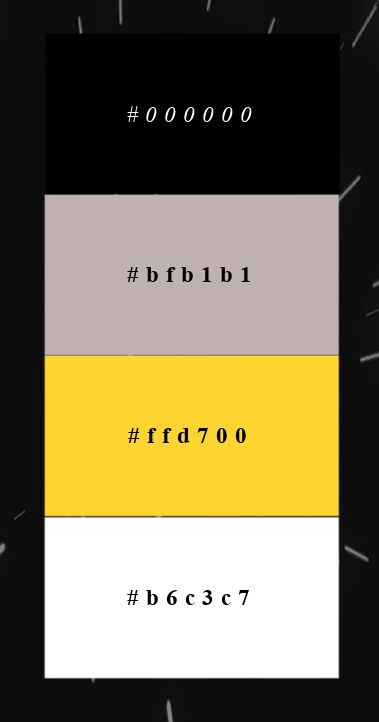

# SUBMISSION
## Deployment

The project is deployed and can be accessed at [Starathon](https://efthymiakakoulidou.github.io/starathon/index.html).

## Criteria
In this section, we will briefly discuss how our team addressed the applicable criteria:

-  Creative use of CSS frameworks (Bulma, Materialize, Bootstrap) to create an engaging and user-friendly design
-  Well-executed project with effective planning using GitHub Projects and a detailed README.md
-  Strong alignment with the Hackathon theme and innovative ideas
-  The project demonstrates responsiveness, accessibility, and thorough testing
-  Innovative features or functionalities beyond standard requirements
-  Emphasizing collaborative effort, active participation of each team member, inclusive practices, and the quality of code produced

# ABOUT SUBMISSION

## Intro
The Test Of The Force is a fun interactive front-end web application presented in a quiz/trivia format. The quiz/trivia format consists of randomly selected questions based on the Star Wars franchise, in 3 difficulty levels end Users can test their Star Wars knowledge. Youngling is the easy mode, Padawan is intermediate and well Grand Master speaks for itself!

Have fun you shall, little Padawan.....

## Goal

We strive for our users to have fun and challenge their Star Wars trivia.
=======

    - To encourage people to take our Star Wars quiz.
    - To let users select different levels of difficulty.
    - To provide users with feedback so that they know what they have gotten wrong and to learn the correct answer.
    - Anybody interested in having fun and having a quiz about the Star Wars franchise.

## Design
### Colors
The primary color palette for the app is shown below.

### Imagery

### Font
 Font to be used for the logo is 'Star Wars' imported from cdn fonts available at [cdn fonts](https://www.cdnfonts.com). Should this fail to load the fall back font is sans serif.
 Nav font is 'SF Distant Galaxy' imported from cdn fonts available at [cdn fonts](https://www.cdnfonts.com). Should this fail to load the fall back font is sans serif.
 Button font is 'Days One' imported from cdn fonts available at [cdn fonts](https://www.cdnfonts.com). Should this fail to load the fall back font is sans serif.

### Wireframes
Wireframes for a responsive design have been created. The homepage design is shown below. All other wireframes can be viewed [here.](wireframes)

## User Experience (UX)

#### Key information for the site

This section provides insight into the UX process, focusing on who this quiz is for, the main aims of the project and how the website can help users meet their needs.

Project goals:
- To encourage people to take our Star Wars quiz.
- To let users select different levels of difficulty.
- To provide users with feedback so that they know what they have gotten wrong and to learn the correct answer.

## Features

#### Navigation
- The navigation bar is located at the top of each page on the site and is represented with a burger icon. 
- The menu contains links to the Home page, the Jedi page, the Sith Page, and the About us page.
- The Star wars logo on the top left of every page functions also as a link to the home-page.

#### The Game area
- The main part of the Home page is occupied by the game area. Before the game starts the user is called to choose the level of difficulty he wants to play with. The user has 3 choices : Younling, Padawan and Grand Master. When the user hovers over these choices he/she gets to see which level of difficulty they represent. When he chooses a category a sound clip is heard saying "I like those odds".

| Levels | Easy | Intermediate | Hard | 
| ------------- | ------------- | ------------- | ------------- | 
|  |  |  |  | 

#### The Questions
- After the user makes his choice, the background music starts to play, the timer starts, and the first question of the level chosen appears. Below the question are the possible answers. Only one of them is right. Depending on whether the user answered right or wrong or if they did not manage to answer in time they get the appropriate message.

| Answers | Correct | Incorrect | Notime |  
| ------------- | ------------- | ------------- | ------------- |
|  |  |  |  |

| The timer | The music |
| ------------- | ------------- | 
|  |   |

#### The Results Page
- Once the user answers all the 5 questions he/she gets to results page. There he can see how many out of 5 questions he/she has answered right. The user gets a different page according to how he/she did on the game and also a different sound clip.

| Less than 3 | More than 3 | 5 out of 5 | 
| ------------- | ------------- | 
|  |  |  |

#### The Jedi and Sith Page
- The Jedi and Sith page contain information about Star Wars and the basic characters characters of the movies.

|  |  | 
| ------------- | ------------- | 
|  |  | 

#### The About Us Page
- This page contains the teams names as well as links to their linkedIn and Github prfiles.

#### Sound Button
- The sound button allows the user to turn the sound effects on and off throughout the game with one click.

### User Stories

#### First-Time Visitor Goals

- As a first-time visitor, I want to take part in a Star Wars quiz so that I can test my knowledge about the StarWars franchise.
- As a first-time visitor, I want to play the quiz on different devices so that I can use all my devices at my convenience.
- As a first-time visitor, I want to navigate easily the site so that I can understand quickly the game mechanics.

#### Returning Visitor Goals

- As a returning visitor, I want to select the level of difficulty so that I can play in different modes and test further my knowledge. 

#### Frequent Visitor Goals
- As a frequent visitor, I want to select the level of difficulty so that I can unlock as many questions as possible to improve. 

---

## Tech
The Test Of The Force team made use of vanilla HTML3, CSS5 and JavaScript to bring our vision to life.

## Testing
Please refer to [TESTING.md](TESTING.md) file for all testing carried out.

## Credits
In the credits section, we provide information about the sources used
Fonts imported from [cdn fonts](https://www.cdnfonts.com).
Image titles created at [flaming text](https://eu1.flamingtext.com).
All sounds and sound effect sourced from [Myinstants Star Wars Sound Board](https://www.myinstants.com/en/search/?name=star%20wars).
The background image used throughout is sourced from [freepik](https://www.freepik.com/free-photos-vectors/star-wars-background).
The storm trooper modal image is sourced from [wallpapers.com](https://wallpapers.com/star-wars-background).
The sound button icon is sourced from [font awesome](https://fontawesome.com/).

## The Starathon Team and contributors

| Member | Role |  
|--|--|
| [Efthymia Kakoulidou](https://github.com/EfthymiaKakoulidou) | Scrum Master/Results Page/About page |
| [João Rodrigues](https://github.com/Joao4569) | Javascript Developer/Interactivity/Game Logic |
| [Gemma Butcher](https://github.com/GemmaButcher-dev) | Design/Content |
| [María Ángeles](https://github.com/Zest-studi-o) | 404 Page/Testing |
| [Vernell C](https://github.com/VCGithubCode) | Frontend Navbar Logic Functionality/Styling/Content/Design |
| [Grace How](https://github.com/grace-ghb) | 505 Page |
