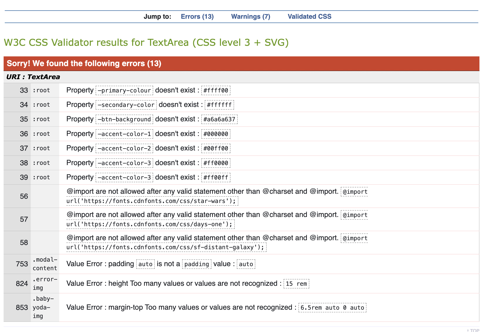
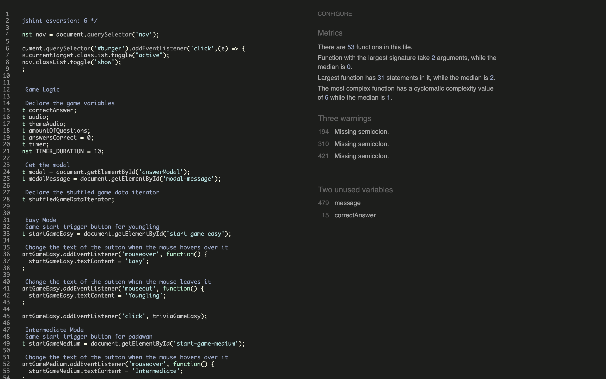

## CONTENTS

* [AUTOMATED TESTING](#AUTOMATED-TESTING)
  * [W3C Validator](#W3C-Validator)
  * [Wave](#Wave)
  * [JavaScript Validator](#JavaScript-Validator)
  * [Lighthouse](#Lighthouse)
* [MANUAL TESTING](#MANUAL-TESTING)
  * [Testing User Stories](#Testing-User-Stories)
  * [Full Testing](#Full-Testing)
* [BUG TRACKER](#BUG-TRACKER)
  *  [Solved Bugs](#Solved-Bugs)
  *  [Known Bugs](#known-Bugs)

- - -

User stories were created to aid developing a test plan, the test plan includes passing validator and manual testing using different operative systems and screen sizes, the plan ensures that the user stories are met and our product is delivered to them taking their needs into consideration.

## AUTOMATED TESTING

### W3C Validator

[W3C](https://validator.w3.org/) was used to validate the HTML on all pages of the website. It was also used to validate the CSS.

#### CSS
Some errors minor errors were found and tackled for css until the results showed no errors. 

Fixed. 

#### HTML
All pages passed the html validator returning no issues.

### WAVE
Each page was run through the Web Accessibility Evaluation Tool (WAVE). 
Different shades of yellow where used until the colour contrast passed the validator, a grey box background was added so it could be better visible. 

### JavaScript Validator - Jshint
[jshint](https://jshint.com/) was used to validate the JavaScript. 
Minor errors returned regarding missing semicolons or unused functions. 

Those errors were tackled. 

### Lighthouse
We used Lighthouse within the Chrome Developer Tools to test the performance, accessibility, best practices and SEO of the website.

---

- - -

## MANUAL TESTING

### Testing User Stories

`First-Time Visitors`
| Goals | How are they achieved? |
| :--- | :--- |
| As a first-time visitor, I want to take part in a Star Wars quiz so I can test my knowledge about Star Wars. | The quiz questions offer a varied range of questions divided in different levels of difficulty|
| As a first-time visitor, I want to play the quiz in different devices so that I can use all my devices at my convenience. | The game is fully responsive and can be played in any screen size |
| As a first-time visitor, I want to navigate easily the site so that I can understand quickly the game mechanics. | The game is easy to understand and further instructions are provided in the welcome page |

`Returning Visitors`
| Goals | How are they achieved? |
| :--- | :--- |
| As a returning visitor, I want to select the level of difficulty so that I can play in different modes and test further my knowledge | There is a feature which enables the user to select this in the home page |

`Frequent Visitors`
| Goals | How are they achieved? |
| :--- | :--- |
| As a frequent visitor, I want to select the level of difficulty so that I can unlock as many questions as possible to improve. | The game select feature enables the user to select more challenging questions as they progress in knowledge |

### Full Testing
Full testing was performed on the following devices:

- Large screen:
  - Apple Mac 24 inch size.
- Laptop:
  - Macbook Pro 2023 14 inches screen and Mac OS
- Android Mobile Devices:
  - OnePlus 7T 

Each device tested the site using the following browsers:
- Google Chrome
- Safari
- Firefox

### Test Cases
`All pages`
| Feature | Expected Result | Testing Performed | Actual Result | Pass/Fail |
| --- | --- | --- | --- | --- |
| The Sites title | Clicking on the logo link directs the user back to the home page | Clicked title | Home page loads | Pass |
| Fav icon | The fav icon shows when visiting the page | Visited page | The fav icon correctly displays | Pass |

`Home page`
| Feature | Expected Result | Testing Performed | Actual Result | Pass/Fail |
| --- | --- | --- | --- | --- |
| Intro section | The intro section displays correctly| Click on home page and look at the instructions | The content is clear and concise and informs the user on what each difficulty mean | Pass |
| Youngling -Easy Quiz | The easy button directs the user to the easy quiz, questions from this category, easy are loaded | Click on the easy button | The easy quiz page loads pulling easy questions | Pass |
| Padawan - Medium Quiz | The medium button directs the user to the easy quiz, questions from this category, medium are loaded | Click on the medium button | The medium quiz page loads pulling medium questions | Pass |
| Grand Master - Hard Quiz | The hard button directs the user to the hard quiz, questions from the category, hard are loaded correctly | Click on the hard button | The hard quiz page loads correctly | Pass |

`Game pages`
| Feature | Expected Result | Testing Performed | Actual Result | Pass/Fail |
| --- | --- | --- | --- | --- |
| Stopwatch | A stopwatch shows while the questions are being populated | Click on any question | The stopwatch shows while answering the questions | Pass |
| Next Question button | Next question button is working when clicking on it and goes to the next one| Click on any question, answer it| The questions are moving to the next one | Pass |
| Start sound\stop |A button should allow to turn on and off the audio | Click on turn on or off the audio button | The button should allow the user to have any of those choices| Pass |

`End page`
| Feature | Expected Result | Testing Performed | Actual Result | Pass/Fail |
| --- | --- | --- | --- | --- |
| Back home | The back home button redirect to the main page| Play any game and reach the end page | The correct page is loaded when the go back button is clicked | Pass |

`404 page`
| Feature | Expected Result | Testing Performed | Actual Result | Pass/Fail |
| --- | --- | --- | --- | --- |
| Error page | The page shows when there is an issue | Break the game | The 404 page shows | Pass |
| Back home page | The page redirects the user to the home page once triggered | Click on the go back home button at the 404 page | The user is redirected to the home page with no issues | Pass |

---

## BUG TRACKER
The bugs are getting tracked on Github pages and assigned to the developer(s) in charge of fixing them

---